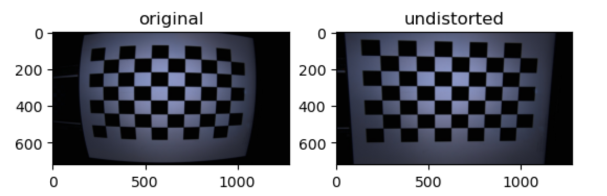

# :camera_flash:相机标定

  通过相机拍摄不同方向的棋盘格来对相机的内参、畸变系数进行标定，进而矫正后续拍摄的图片

-------

### :rocket:使用方法

1.  将拍摄的棋盘格图片放在 calibrate_images/v1 文件夹中；

2.  运行 main.py 文件，只需要修改第4段代码块的第1句代码 `w, h = 9, 6` 为自己拍摄的图片的棋盘格横纵交点数量即可。

3.  矫正效果：

   
